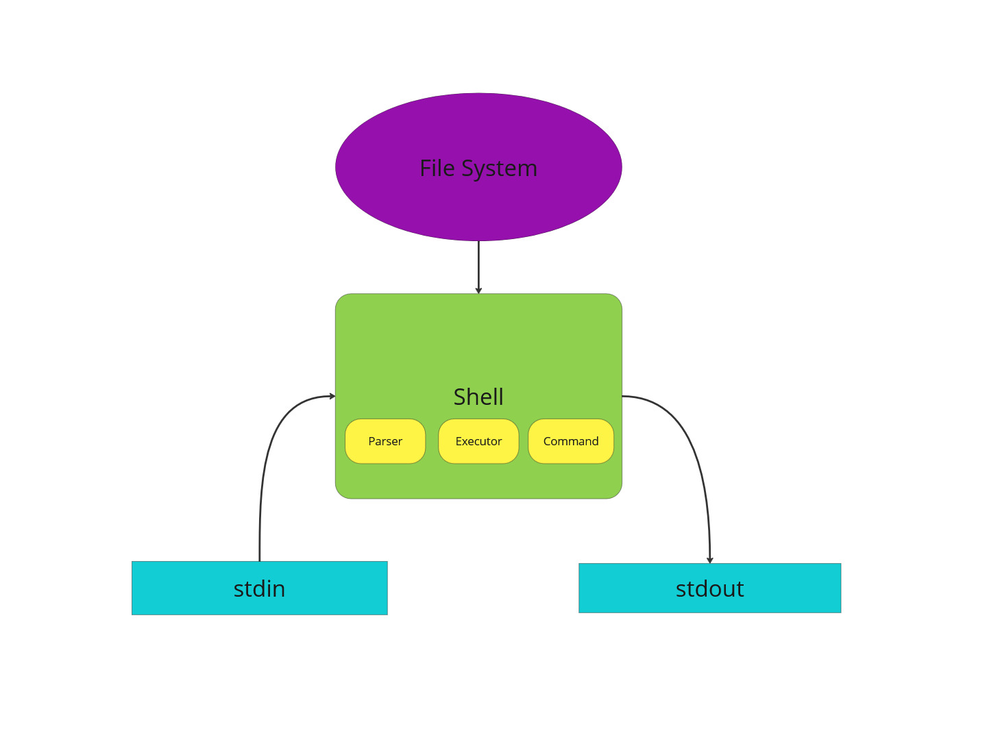
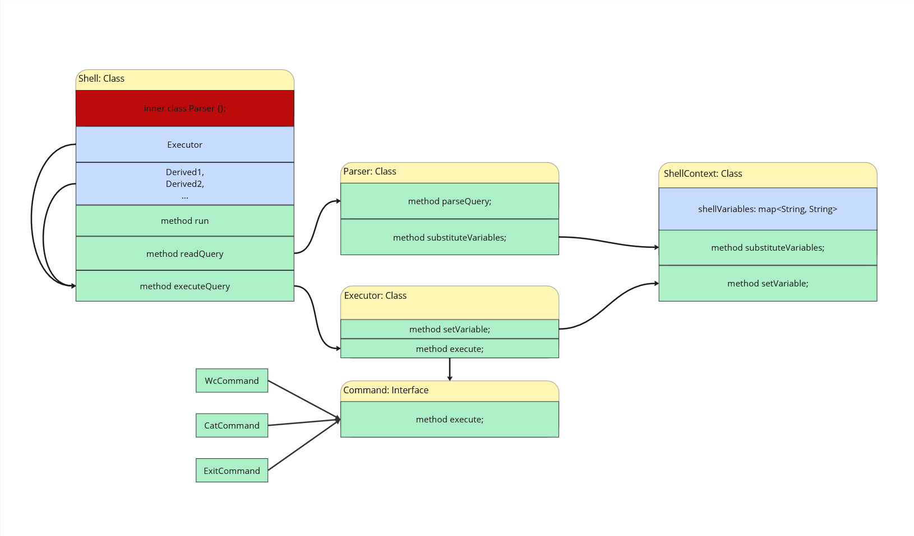

# Project structure

The project itself consists of two parts:
1. CLI implementation
2. Testing environment

### CLI implementation
This part of the project contains implementation of CLI interface.

Structure diagram:

Class diagram:

Following central classes are intended to be implemented:
1. __Shell__ - entry point and orchestrator for the entire system.
* Objects:\
	Derived1, Derived2, … - instances of Command implementations.\
  	Executor executor;
* Methods:
	* run - main loop of program.
	* readQuery - responsible for parsing input from User and returning it.
	* executeQuery - executes tokenized input (query) from User.

2. __Parser__ - responsible for input tokenization and construction of command expression. Is based on split by space symbols; quote symbols (‘, “) are respected; command options start with -. Parsed commands are stored as lists of strings - may change in the future based on additional requirements (e.g., with added requirement of supporting &&/|| operators it may be beneficial to return parsed commands as prefix notation expression).

* Methods:

    * parse - reads input string and returns a list of parsed commands with args.

3. __Executor__ - responsible for executing the command expression in accordance with set priority/rules. Also handles command return codes and pipeline mechanics.
* Methods:
    * constructor - adjusts variables for interaction with the environment.
    * execute - executes given query using defined __Command__ objects.

4. __Command__ - interface for simulated commands/utilities like _grep_ and _echo_; will be implemented by various classes such as _EchoCommand_.
	
* Methods:
    * execute() - executes the command with a passed list of args and options. Returns an exit code signaling an execution success/failure, with 0 as designated value for success & positive integers - non-success.
    
    All command classes are implementations of this interface, which allows Executor to easily organize/schedule complex command expressions. Notable _Command_ implementations include _Exit_, which shuts down the CLI, and _ExternalCommand_, which runs the provided expression as external shell command.

### Testing environment
Implemented with the __JUnit__ __framework__, this part of the project contains unit & integration tests used to verify correctness of the main part.
__JUnit__ __framework__ was chosen because of familiarity of both contributors with it. __Mockito__ was chosen to simplify mock object creation.
